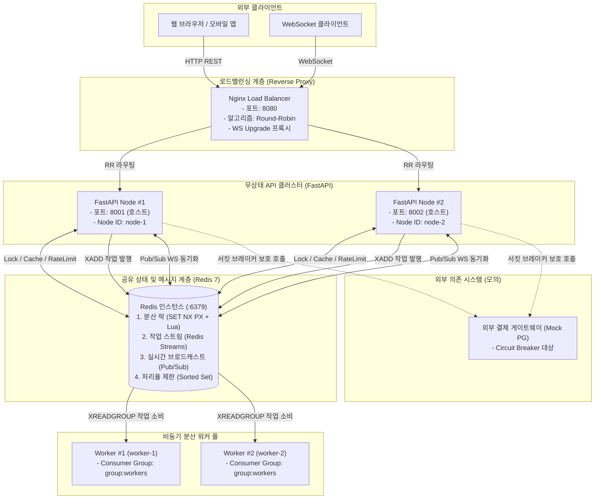

# 01. 분산 서버 시스템 아키텍처 개요

본 문서는 `backend-framework` 저장소의 분산 서버 플레이그라운드 전체 아키텍처와 설계 철학을 설명합니다.

---

## 1. 분산 시스템 설계의 기본 철학

### 1.1 단일 서버(Scale-Up)의 한계
- **수직 확장(Scale-Up)의 한계**: CPU/메모리 증설은 비용 대비 효율이 급격히 감소하며, 물리적 한계가 존재합니다.
- **단일 장애점(SPOF, Single Point of Failure)**: 한 서버가 다운되면 전체 서비스가 중단됩니다.
- **리소스 경합**: CPU 집약적 작업(AI 추론, 대용량 계산)이 실시간 API 응답 스레드를 블로킹하여 전체 레이턴시가 증가합니다.

### 1.2 수평 확장(Scale-Out)의 핵심 원칙
1. **무상태(Stateless) API 계층**:
   - 서버 인스턴스 메모리에 클라이언트 세션이나 비즈니스 상태를 저장하지 않습니다.
   - 어느 노드로 요청이 전달되더라도 동일한 응답을 낼 수 있도록 구성합니다.
2. **공유 상태(Shared State) 계층 분리**:
   - 데이터베이스, 분산 락, 토큰 검증, 세션 정보는 중앙의 고성능 인메모리 저장소(Redis) 및 DB 클러스터에서 단일 진실 공급원(Single Source of Truth)으로 관리합니다.
3. **비동기 작업의 분리 (Decoupling via Queues)**:
   - 요청-응답 루프에서는 메타데이터만 검증 후 큐에 발행(`202 Accepted`)하고, 실제 무거운 처리는 백그라운드 분산 워커 풀이 수행합니다.

---

## 2. 전체 시스템 구성도 (Cluster Topology)

---

## 3. 계층별 역할 및 기술 스택

| 계층 | 구성 요소 | 기술 스택 | 주요 역할 |
|---|---|---|---|
| **로드밸런서** | `lb` | Nginx (Alpine) | - 8080 포트 단일 진입점 - 라운드로빈 로드밸런싱 - WebSocket `Upgrade` 헤더 전달 |
| **API 노드** | `api-node-1` `api-node-2` | FastAPI, Uvicorn, Python 3.12 | - RESTful API 제공 - 무상태 요청 처리 - 작업 발행(Producer) - WebSocket 연결 유지 |
| **공유 상태** | `redis` | Redis 7.0 (Alpine) | - 분산 락 원자성 보장 - 슬라이딩 윈도우 카운터 - Redis Streams 작업 큐 - Pub/Sub 메시지 버스 |
| **분산 워커** | `worker-1` `worker-2` | Python 비동기 워커 프로세스 | - Redis Streams Consumer Group 참여 - 작업 분산 병렬 처리 및 상태 업데이트 - `XACK` 처리 완료 보장 |

---

## 4. 네트워크 및 포트 맵

| 컨테이너 이름 | 내부 포트 | 호스트 바인딩 포트 | 설명 |
|---|---|---|---|
| `dist-load-balancer` | 80 | `8080` | 전체 서비스 통합 진입점 |
| `dist-api-node-1` | 8000 | `8001` | API Node #1 개별 디버깅용 포트 |
| `dist-api-node-2` | 8000 | `8002` | API Node #2 개별 디버깅용 포트 |
| `dist-redis` | 6379 | `6379` | 공유 Redis 데이터 저장소 |
| `dist-worker-1` | - | - | 내부 네트워크 전용 백그라운드 워커 |
| `dist-worker-2` | - | - | 내부 네트워크 전용 백그라운드 워커 |
