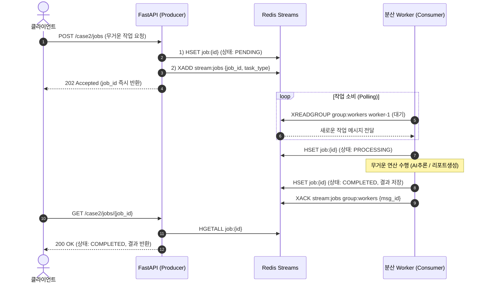
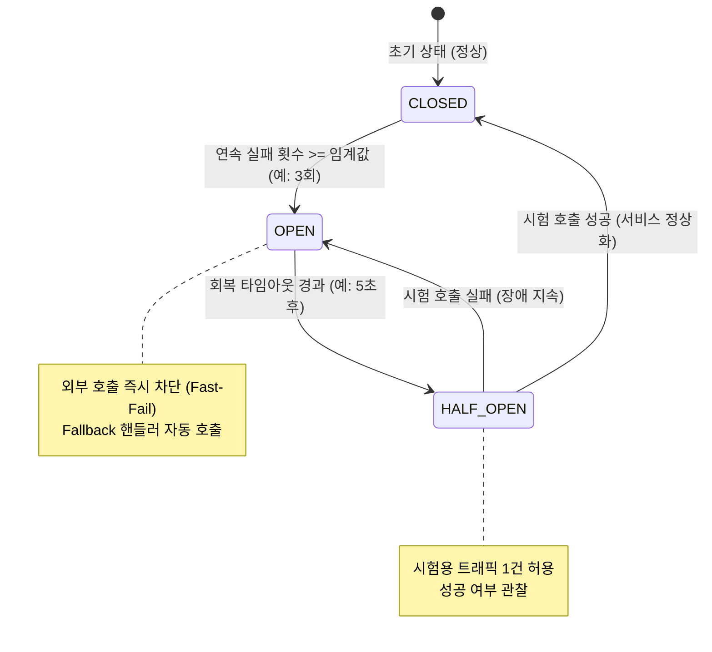

# 02. 분산 서버 핵심 4대 패턴 상세 가이드

본 문서는 플레이그라운드에 구현된 4대 분산 아키텍처 패턴의 원리, 코드 구조, 그리고 실무 트레이드오프를 상세히 설명합니다.

---

## 📌 Case 1: 무상태(Stateless) API & Redis 분산 락 (Distributed Lock)

### 1.1 Race Condition의 실체
다중 서버 환경에서 2개 이상의 인스턴스가 동시에 공유 자원(예: 한정 수량 티켓, 재고, 쿠폰)에 접근할 때 발생합니다:
1. `Node 1`이 DB에서 잔여 재고 1개를 조회함 (`stock = 1`)
2. `Node 2`도 거의 동시에 DB에서 잔여 재고 1개를 조회함 (`stock = 1`)
3. `Node 1`이 1개를 차감하여 `stock = 0`으로 업데이트함
4. `Node 2`도 자신이 읽은 1개에서 1개를 차감하여 `stock = 0`으로 덮어씀
- **결과**: 재고 1개가 2명의 사용자에게 중복 판매되는 치명적인 데이터 부정합 발생!

### 1.2 해결책: Redis 분산 락 구현 원리
단일 서버의 `threading.Lock()`이나 `asyncio.Lock()`은 해당 프로세스 내부에서만 동작하므로, 여러 서버 프로세스 간 동기화를 위해 **중앙 Redis**를 락 관리자로 사용합니다.

#### [1단계: 락 획득 (Acquire)]
```python
# SET lock:resource token NX PX ttl_ms
acquired = await redis.set(f"lock:{resource}", token, px=5000, nx=True)
```
- `NX=True`: 키가 존재하지 않을 때만 생성 (원자적 상호 배제).
- `PX=5000`: 5초 후 자동 만료 (TTL). 서버가 락을 쥐고 비정상 종료(Crash)되더라도 데드락(Deadlock)에 빠지지 않음.
- `token`: 요청자별 고유한 UUID.

#### [2단계: 락 안전 해제 (Release)] — 왜 Lua Script가 필요한가?
락을 해제할 때 단순히 `DEL lock:resource`를 호출하면 치명적인 버그가 발생합니다:
- Node 1이 락을 잡고 작업하던 중, 예상보다 시간이 오래 걸려 5초 TTL이 만료됨.
- Node 2가 빈 락을 획득함.
- 그 순간 뒤늦게 작업이 끝난 Node 1이 `DEL`을 호출하면 **Node 2가 정상적으로 소유 중인 락을 강제로 삭제**해 버립니다!

따라서 **"내가 잡은 락의 토큰과 일치할 때만 삭제한다"**는 검증과 삭제가 단일 원자적 명령으로 수행되어야 하며, 이를 위해 **Lua Script**를 사용합니다:
```lua
if redis.call("get", KEYS[1]) == ARGV[1] then
    return redis.call("del", KEYS[1])
else
    return 0
end
```

### 1.3 분산 슬라이딩 윈도우 Rate Limiter
- Redis `Sorted Set`에 요청 타임스탬프(`score`)를 기록합니다.
- `ZREMRANGEBYSCORE`: 현재 시각 기준으로 윈도우(예: 10초) 이전의 오래된 타임스탬프를 원자적으로 제거.
- `ZCARD`: 윈도우 내의 남은 요청 개수가 허용치 이내인지 검사.
- 서버가 100대로 늘어나더라도 클라이언트 식별자(IP/UserId) 기준으로 정확한 전역 처리율 제한이 보장됩니다.

---

## 📌 Case 2: 이벤트 기반 비동기 작업 큐 & 분산 워커



### 2.1 왜 Redis Streams인가? (비교 분석)
| 기술 | 장점 | 단점 / 한계 | 적합 시나리오 |
|---|---|---|---|
| **Redis Pub/Sub** | 매우 빠르고 단순 | 메시지 영속성 없음, 수신자 없으면 즉시 유실 | 실시간 채팅, 단순 브로드캐스트 |
| **Redis List (`LPUSH`/`RPOP`)** | 단순 큐 구현 가능 | Consumer Group 부재, 장애 시 재처리(ACK) 복잡 | 단순 로컬 작업 큐 |
| **Redis Streams** | **Consumer Group 지원, 메시지 영속성, `XACK` 신뢰성, 오프셋 추적** | Celery/RabbitMQ 대비 고도화된 라우팅 기능은 직접 구현 필요 | **현대적 마이크로서비스 비동기 큐** |
| **RabbitMQ / Kafka** | 초대규모 엔터프라이즈 처리, 복잡한 토폴로지 | 별도 무거운 브로커 운영 비용 | 대규모 데이터 엔지니어링 |

---

## 📌 Case 3: 실시간 다중 서버 브로드캐스트 (WebSocket + Redis Pub/Sub)

### 3.1 단일 서버 WebSocket의 문제
```text
[클라이언트 A] ---> [Server 1 (메모리 커넥션 풀)]
[클라이언트 B] ---> [Server 2 (메모리 커넥션 풀)]
```
- 클라이언트 A가 Server 1에 메시지를 보내면, Server 1은 자신의 로컬 메모리에 있는 커넥션에만 브로드캐스트할 수 있습니다.
- Server 2에 연결된 클라이언트 B는 메시지를 전달받을 수 없습니다.

### 3.2 Redis Pub/Sub 기반 크로스 노드 동기화
```text
[클라이언트 A] -> [Server 1] -> [Redis: ws:room:lobby] -> [Server 2] -> [클라이언트 B]
                                     |
                                     +-----------------> [Server 1] -> [클라이언트 A]
```
1. 각 FastAPI 인스턴스는 시작 시(lifespan) 백그라운드 태스크로 `redis.pubsub()` 리스너를 실행하여 `ws:room:*` 채널을 구독합니다.
2. 어떤 서버에서든 WebSocket 메시지가 수신되면, 해당 메시지를 Redis 채널로 `PUBLISH`합니다.
3. 클러스터의 모든 서버 인스턴스가 Redis로부터 메시지를 수신하여, 각자 로컬에 물려 있는 WebSocket 클라이언트들에게 안전하게 전달합니다.

---

## 📌 Case 4: 서비스 간 통신 장애 격리 (Circuit Breaker & Fallback)

### 4.1 마이크로서비스 연쇄 장애 (Cascading Failure)
외부 결제 PG사 서버가 응답 지연(Hang)에 빠졌을 때:
- 클라이언트 요청이 API 서버로 계속 유입됨.
- API 서버의 스레드/커넥션 풀이 외부 PG사 응답을 기다리느라 고갈됨.
- 결국 정상 동작하던 다른 API 엔드포인트까지 먹통이 되어 전체 시스템이 다운됨!

### 4.2 서킷 브레이커 상태 전이 머신 (State Machine)



- **CLOSED (닫힘)**: 모든 트래픽이 정상적으로 외부 서비스를 호출합니다. 실패율을 카운트합니다.
- **OPEN (열림)**: 연속 실패가 3회를 넘으면 즉시 회로를 엽니다. 이후 들어오는 요청은 **외부 서비스를 호출하지 않고 즉시 Fallback 응답을 반환(Fast-Fail)**하여 서버 리소스를 보호합니다.
- **HALF_OPEN (반열림)**: 일정 시간이 지난 뒤 시험 삼아 요청을 보내보고, 성공하면 CLOSED로 복구, 실패하면 다시 OPEN으로 유지합니다.
